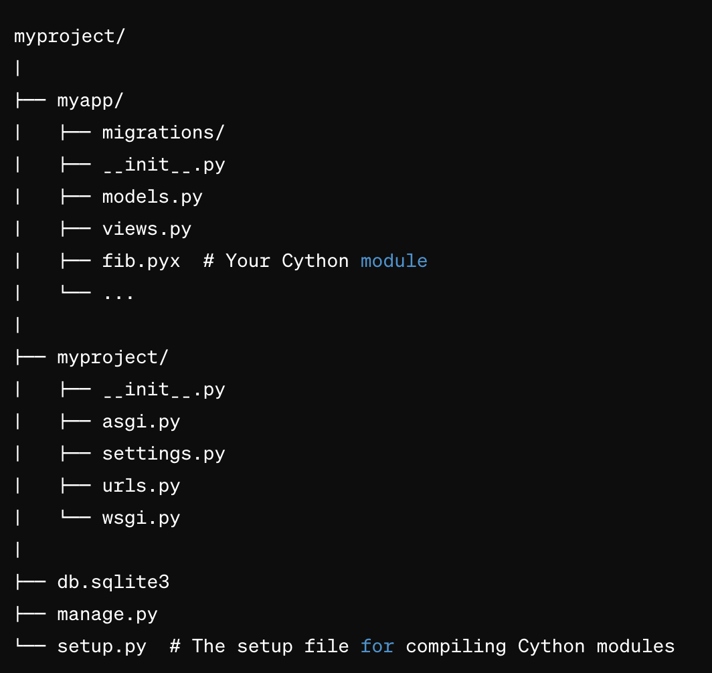

# Cython Optimization

Cython can significantly speed up parts of your application that are computationally intensive, but it also adds complexity to your build process and requires maintaining code in a language that is slightly different from Python.

Identify a part of your application that is computation-heavy. This could be a section of your recommendation algorithm, data processing, or another suitable aspect. Implement this part in Cython, and integrate it with your Django application.

## Deployment

To deploy this project run

```
pip install cython
python setup.py build_ext --inplace

```

--------------


